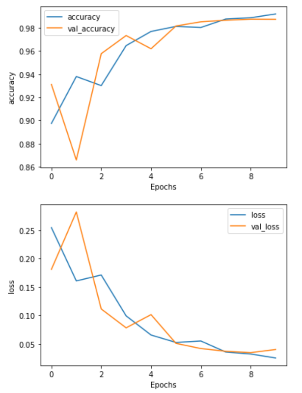

# Covid-19 Fake News Detection

## Kaggle Notebook Link:-
    https://www.kaggle.com/pradip11/fake-news-detection
    
## Language:-
    Python3
    
## Library Requirements:-
    1. warnings
    2. pandas
    3. bs4
    4. string
    5. nltk
    6. sklearn
    7. numpy
    8. seaborn
    9. matplotlib
    10. tensorflow

## Data Source:-
    https://www.kaggle.com/clmentbisaillon/fake-and-real-news-dataset  
    https://www.kaggle.com/danielwillgeorge/glove6b100dtxt

## Result:-

